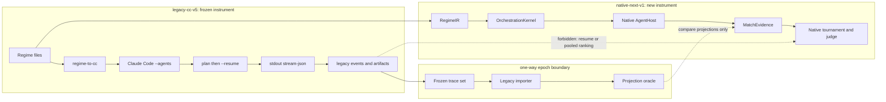
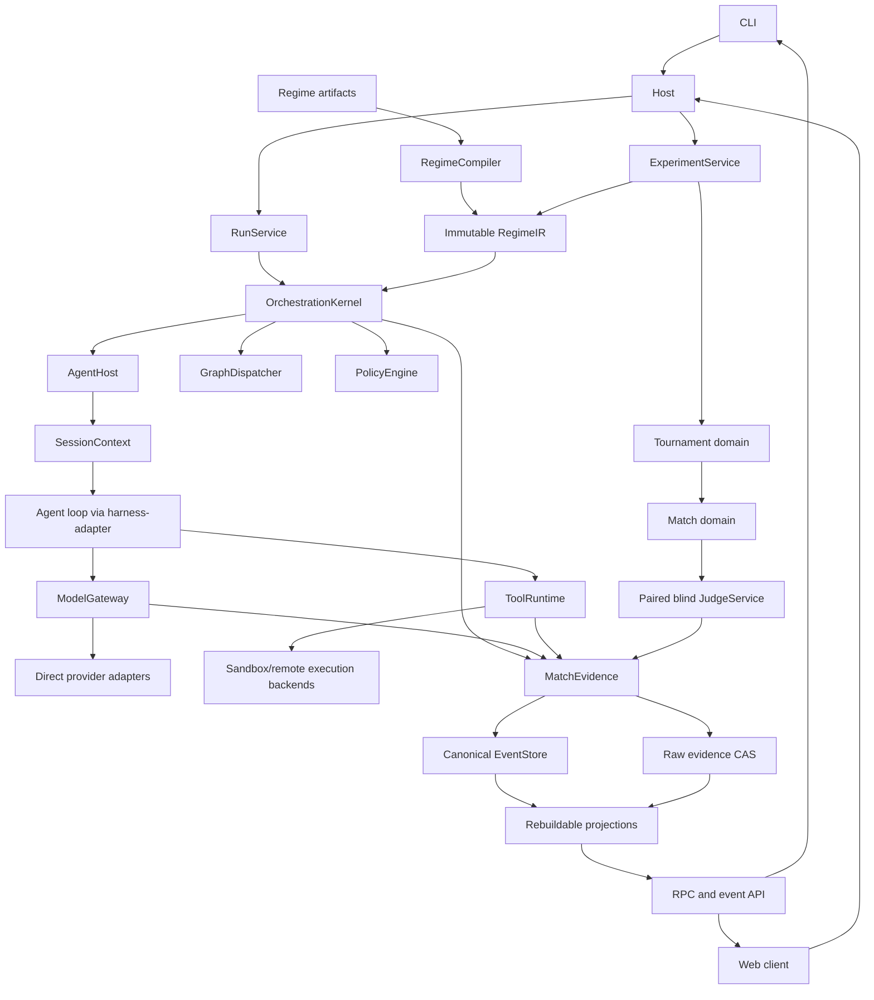
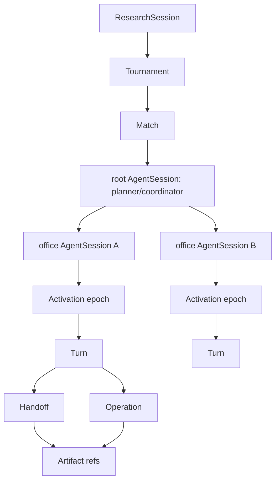
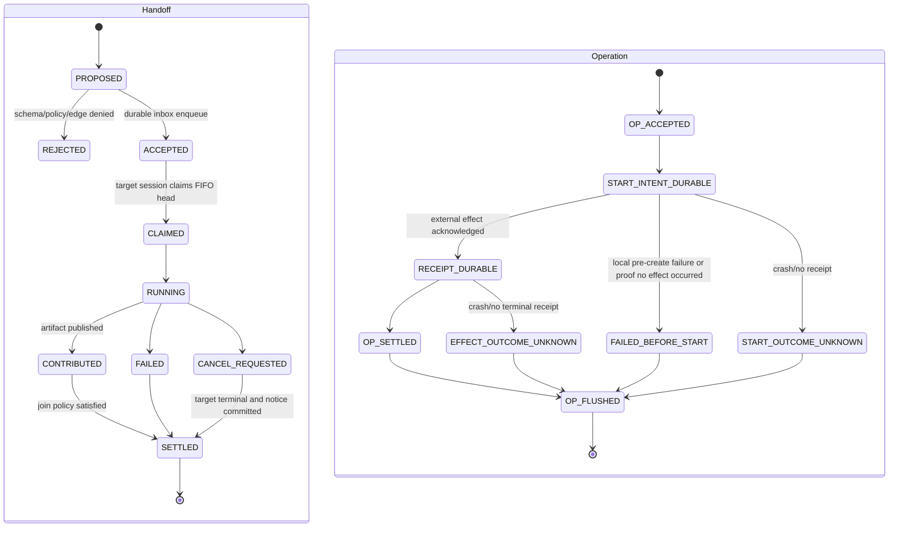
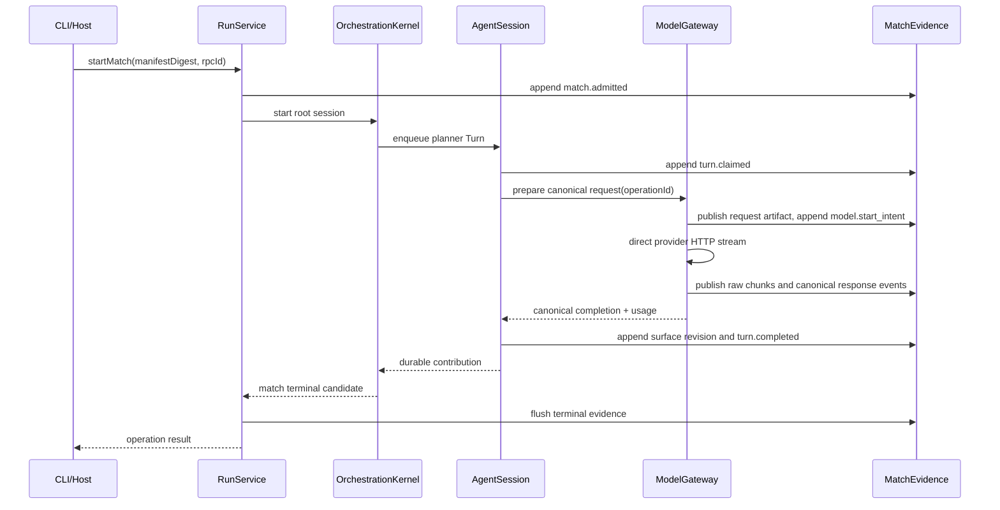
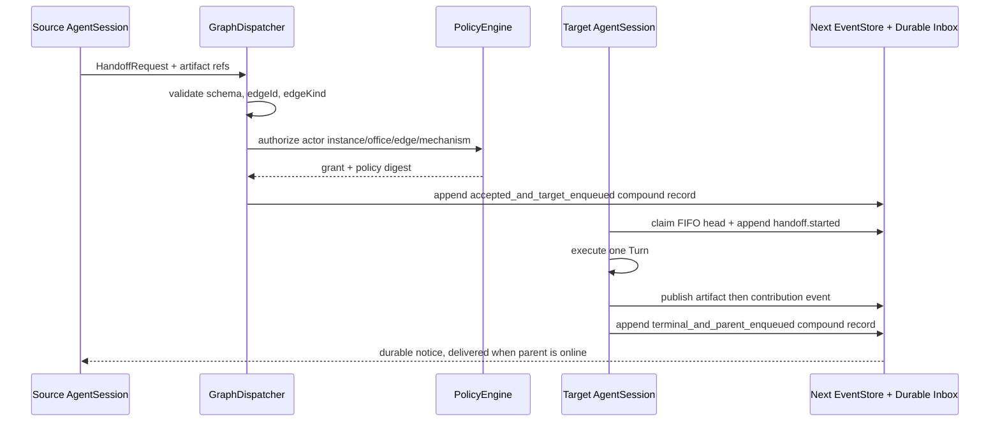
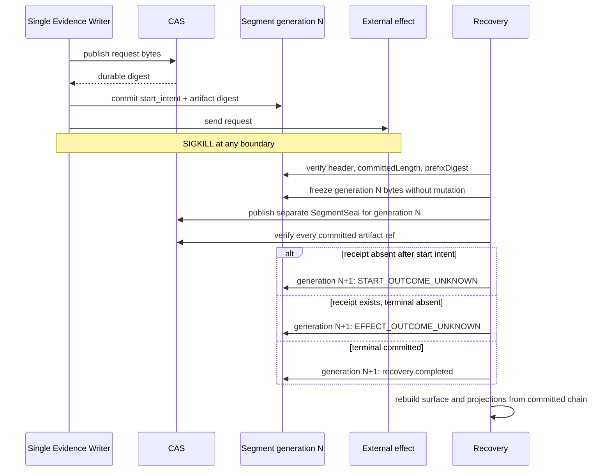
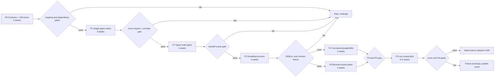

# CivAgent Next: Harness-Inspired Native Agent Runtime Architecture and Research Plan

**Status:** Proposed architecture and falsifiable research plan

**Supersedes:** The earlier narrow sidecar/adoption plan, after clarification of the product goal

**Legacy CivAgent baseline:** `1460441528069465dca7263dba3e9ac01b18c78a`

**Pinned DeepSeek Harness baseline:** `47f943859bef60e4160492346772ded9b24f765a` (`0.1.0-rc.5` source)

**Runtime epochs:** `legacy-cc-v5` and `native-next-v1`; every run also pins an `instrumentVersion`

**Delivery estimate:** 2–3 engineers, 18–20 calendar weeks, approximately 28–38 engineer-weeks

**Decision owner:** CivAgent maintainers and research lead

## 1. Executive decision

Build **CivAgent Next as a native agent runtime with no Claude Code dependency**.

The recommended architecture is:

> **Cordis-native lifecycle composition + pinned Harness leaf packages + a greenfield CivAgent domain runtime.**

This is neither a full Harness profile/Loader application nor a from-scratch rewrite of every agent primitive.

- Cordis supplies scoped dependency injection, `Context`, `Fiber`, effect ownership, and disposal hooks. CivAgent supplies the ordered match-level shutdown protocol.
- Selected Harness packages supply reviewed leaf seams for LLM calls, sessions, system prompts, tools, the agent loop, credentials, Typert/RPC, and client connection.
- CivAgent owns research identity, topology, policy, orchestration, evidence, tournaments, judging, skills, and causal analysis.
- One package, `@civagent/harness-adapter`, is the only import boundary to Harness and may import only published package exports.
- Harness is pinned to commit `47f943859bef60e4160492346772ded9b24f765a`. Upgrades are deliberate compatibility projects, never floating dependency updates.
- `instrumentVersion` hashes the Harness/Cordis commit, CivAgent runtime build, provider adapters, request serializer, prompt/tool schemas, scheduler, surface/compaction/retry policy, and judge protocol. A model-visible or orchestration-semantic change creates a new instrument version.
- Runtime registration is driven by explicit TypeScript boot code and a content-hashed static `RuntimeManifest`. Registration closes before a run starts.

The plan intentionally does **not** target semantic equivalence with the current Claude Code integration. The current implementation becomes a frozen experimental instrument named `legacy-cc-v5`. The new runtime is a separate epoch named `native-next-v1`. Results from the two epochs must never be pooled, appended to the same leaderboard, or described as longitudinal improvement.

Legacy traces remain useful as:

1. frozen behavioral fixtures;
2. input to a one-way legacy importer;
3. projection oracles for shared domain concepts;
4. an explicit runtime factor in causal experiments.

After the native epoch meets its gates, Next removes these legacy implementation details:

- Claude Code `--agents` compilation;
- plan session `--resume`;
- Claude stream-JSON parsing;
- `parent_tool_use_id` and `subagent_type` inference;
- synthetic `HOME` trees and skill symlinks;
- stdout as the domain-event transport;
- `SIGKILL` as the VETO mechanism;
- detached tournament execution.

What survives is the research domain: regime/persona/topology/control inputs, the plan-before-enforcement concept, participation completeness, declared/observed/exercised separation, paired blind judging, eligibility rules, and manifest/artifact lineage.

## 2. Epoch boundary and migration policy



### Epoch invariants

1. Every tournament, match, judge result, projection, and leaderboard declares its `runtimeEpoch`.
2. A match cannot change epoch after admission.
3. A legacy session cannot be resumed by Next.
4. A Next session cannot be exported as a fake Claude Code session.
5. The legacy importer is read-only and one-way.
6. A dashboard may compare epochs only in a clearly labelled factorial analysis.
7. Rankings are epoch-scoped. There is no shared cumulative ranking.
8. Claims about Next-versus-legacy are runtime claims, not topology claims.
9. Rankings and confirmatory pools are also scoped by `instrumentVersion` semantic equivalence class. A Harness, adapter, prompt, tool, scheduler, retry, compaction, or judge change cannot pool with an earlier instrument unless byte/effect conformance proves it is semantically unchanged.

## 3. Baseline evidence and what it does not prove

At the pinned CivAgent commit:

- backend tests pass **522/522**;
- frontend tests pass **25/25**;
- backend CI, frontend build, and frontend lint pass;
- lint has only six pre-existing compiler-readiness warnings.

This proves that `legacy-cc-v5` is internally healthy at its baseline. It does not validate the Next architecture, provider equivalence, crash recovery, cross-platform behavior, scientific comparability, or Harness compatibility.

The baseline also exposes reasons not to carry the old execution mechanism forward:

| Legacy mechanism | Native replacement |
|---|---|
| Markdown identity compiled into Claude `--agents` | Immutable `RegimeIR` consumed by `GraphDispatcher` |
| Plan call followed by opaque `--resume` | First-class planner `AgentSession` followed by typed handoffs |
| Subagent identity inferred from stream fields | Durable `AgentSession`, `Activation`, and `Handoff` identities |
| Stdout JSON as evidence transport | In-process canonical event writer with raw artifact capture |
| Marker text triggers authority | `PolicyEngine` grant and structured mechanism operation |
| Process kill implements VETO | Domain cancellation plus effect-aware operation cancellation |
| Detached, uncapped tournament children | Owned `Run` tree with caps, deadline, cancel, join, and durable status |

## 4. Harness reuse boundary

### 4.1 Adopt, adapt, and reject

| Capability | Decision | Next use | Constraint |
|---|---|---|---|
| Cordis `Context`, `Fiber`, effect, inject, scope | **Adopt** | Runtime, match, session, activation, and operation lifetimes | Lifecycle mechanism, not domain authority |
| DSH LLM service and provider seams | **Adapt** | Canonical direct model request/stream boundary | Provider cannot orchestrate or own identity |
| DSH Session | **Adapt** | One agent's model-visible conversation surface | Never Tournament/Match truth |
| DSH system prompt | **Adapt** | Deterministic prompt assembly from pinned inputs | Request bytes must be reconstructible |
| DSH tools and agent loop | **Adapt** | Single-agent turn/tool engine behind adapter | CivAgent policy and evidence wrap every effect |
| DSH agent | **Adapt** | Leaf agent execution primitive | `AgentSpec` and session identity remain CivAgent-owned |
| DSH credentials | **Adapt** | `CredentialRef` resolution through `SecretBroker` | No ambient discovery or secret serialization |
| Typert protocol/RPC and Connection | **Adapt** | Shared CLI/browser control contracts | Explicit scoped event feed; no Context broadcast |
| Loader/profile/home patch/HMR | **Reject** | None | Explicit TypeScript boot only |
| Agent presets | **Reject** | `AgentSpec` comes from `RegimeIR` | No hidden persona treatment |
| Compaction defaults | **Reject** | Off by default; explicit research treatment only | Raw evidence is permanent |
| Retry defaults | **Reject** | No implicit retry | New retry means new `operationId` |
| Self-modification and plugin market | **Reject** | Audited skill provenance instead | Static manifest closes at admission |
| Jobs/schedule/workflow | **Reject** | CivAgent owns tournament scheduling | Avoid unused control planes |
| PTY and Code Mode | **Reject** | Not registered | Authority and evidence are not defined |
| ACP/MCP integration | **Defer** | No initial dependency | Admit only for a concrete, consumed contract |

### 4.2 Dependency rule

Only `packages/next/harness-adapter` may depend on `@deepseek-ai/*` or Cordis packages.

It must:

- pin exact versions resolved from Harness commit `47f9438`;
- import only package `exports`, never Harness internal source paths;
- translate external types into `@civagent/contracts` types at the boundary;
- expose adapter capability/version metadata to the manifest;
- contain no CivAgent tournament, topology, policy, or judge decisions;
- pass contract tests before any Harness upgrade is admitted.

Changing Harness core or session schemas, maintaining a long-lived fork, or reaching into private paths is a hard stop.

Next has a separate toolchain floor from legacy CivAgent: Node `22.19.x` or a separately verified `>=24.11` lane, with the Harness-pinned package-manager version. The existing Node 20 legacy lane remains frozen for `legacy-cc-v5`; lowering the Next floor by copying Cordis/Fiber is not an acceptable compatibility shortcut.

## 5. Native Next component architecture



### Authority boundaries

- `ExperimentService` owns research design, assignment, eligibility, and epoch separation.
- `RunService` owns admission, cancellation, and resource envelopes.
- `RegimeCompiler` turns source artifacts into an immutable domain IR.
- `OrchestrationKernel` owns legal progression, not model providers.
- `GraphDispatcher` validates typed handoffs against graph semantics.
- `PolicyEngine` authorizes actions against actor instance, office, edge, mechanism, and grants.
- `AgentHost` owns native session/activation execution.
- `ModelGateway` generates model output only.
- `ToolRuntime` executes declared effects only after policy validation.
- `MatchEvidence` is the scientific system of record.
- Harness Session owns only one agent's conversation/surface.

## 6. Proposed package layout

```text
packages/next/
  contracts/
  domain/
  harness-adapter/
  evidence/
  runtime/
  providers/
  tools/
  host/
  client/
  ui/
  legacy-importer/
```

| Package | Responsibility | May depend on |
|---|---|---|
| `contracts` | IDs, schemas, events, commands, capability and protocol versions | Type/schema libraries only |
| `domain` | `RegimeIR`, tournament, match, judge, eligibility, mechanism semantics | `contracts` |
| `harness-adapter` | Cordis and pinned Harness public-export facade | `contracts`, pinned Harness/Cordis |
| `evidence` | CAS, immutable segments, canonical event writer, projection protocol | `contracts` |
| `runtime` | `RunService`, kernel, session/activation/turn/handoff lifecycle | `contracts`, `domain`, `evidence`, `harness-adapter` |
| `providers` | Registry, direct adapters, canonical streaming, usage/cancel | `contracts`, `evidence`, `harness-adapter` |
| `tools` | Tool registry, effect classes, approval, executors, isolation backends | `contracts`, `evidence` |
| `host` | Explicit boot, experiment/run services, HTTP/RPC/WS endpoints | all server-side Next packages |
| `client` | Generated/shared RPC client and durable event subscription | `contracts` |
| `ui` | Research control plane and evidence visualizations | `client`, `contracts` |
| `legacy-importer` | Frozen legacy trace parsing into labelled import projections | `contracts`, `evidence`; never `runtime` |

Dependency rules:

1. `domain` never imports Harness, HTTP, React, SQLite, or provider SDKs.
2. `providers` and `tools` cannot dispatch agents or mutate topology.
3. `ui` cannot infer domain truth from presentation strings.
4. `legacy-importer` cannot emit native authoritative events.
5. Cross-package payloads use runtime schemas from `contracts`; TypeScript types alone are insufficient.
6. Existing regime, topology, judge rubric, and historical artifacts are inputs to the new packages. A greenfield kernel is not a whole-product rewrite.

## 7. Domain identities and hierarchy



| Entity | Meaning | Identity/lifetime rule |
|---|---|---|
| `ResearchSession` | One preregistered study and analysis namespace | Owns design version; not a chat session |
| `Tournament` | Assigned set of matches under one epoch/design | Owns concurrency/deadline and ranking scope |
| `Match` | Scientific unit for one task/regime/provider/seed assignment | Owns authoritative `MatchEvidence` |
| `AgentSession` | Durable identity and model-visible history for one root or office agent | Survives activation restarts; belongs to one match |
| `Activation` | One in-memory execution epoch of a session | New on resume/recovery; never rewrites earlier turns |
| `Turn` | One claimed FIFO inbox item through model/tool completion | At most one claimed/running turn per session |
| `Handoff` | Typed causal transfer between sessions/offices | Validated against graph and policy |
| `Operation` | One external effect attempt: model request, tool call, spawn, publish | Retry always receives a new ID |
| `Artifact` | Immutable content-addressed bytes plus provenance | Must be durable before an event references it |

IDs are never overloaded:

- `rpcId` correlates a transport request and response;
- `operationId` identifies one effect attempt;
- `tournamentId`, `matchId`, and `sessionId` identify domain entities;
- `activationId`, `turnId`, `handoffId`, and `artifactDigest` retain their own meanings.

## 8. Regime compilation and orchestration protocol

### 8.1 Immutable `RegimeIR`

`RegimeCompiler` validates existing regime/persona/topology/control artifacts and emits:

```ts
type RegimeIR = Readonly<{
  regimeId: string;
  sourceDigest: string;
  agents: readonly AgentSpec[];
  graph: GraphSpec;
  policy: PolicySpec;
}>;
```

- `AgentSpec` pins office, persona artifact refs, model policy, tool grants, and instruction digest.
- `GraphSpec` pins nodes and typed edges with stable `edgeId` values.
- `PolicySpec` pins actor/office/edge/mechanism grants, limits, and approval rules.

The manifest contains the serialized IR digest. No registry, role, tool, provider, policy, or skill can change after match admission.

### 8.2 Structured handoff

`GraphDispatcher` accepts only a `HandoffRequest`; printed markers, natural-language claims, or provider-specific tool metadata have no authority.

```ts
type HandoffRequest = Readonly<{
  handoffId: string;
  sourceOfficeId: string;
  sourceSessionId: string;
  targetOfficeId: string;
  targetSessionId: string;
  edgeId: string;
  edgeKind: "command" | "review" | "information" | "vote" | "escalation";
  artifactRefs: readonly ArtifactRef[];
  causalParentId: string;
  mode: "one-shot" | "continuable";
  context: "fresh" | "fork";
  joinPolicy: "await" | "notify" | "quorum";
  idempotencyKey: string;
}>;
```

`PolicyEngine` authorizes against the concrete actor instance, source and target offices, declared edge and kind, mechanism grant, current match phase, and resource limits. A model printing `[VETO]`, `圣旨`, or another marker is only text unless a typed, authorized mechanism action is submitted.

### 8.3 Orchestration modes

The manifest declares exactly one mode:

| Mode | Meaning | Enforcement claim |
|---|---|---|
| `observational` | Agents may act without roster or graph completeness enforcement | Observe only; no topology compliance claim |
| `roster_enforced` | Required offices must participate | Completeness of roster participation only |
| `graph_enforced` | Handoffs must follow typed authorized edges and settlement rules | Declared-versus-exercised topology claim allowed after oracle gate |

Modes are separate experimental treatments and cannot be pooled.

Participation metrics are also distinct:

- `invoked`: a valid handoff was accepted for the office;
- `started`: the target session claimed its turn;
- `contributed`: a durable artifact or canonical contribution was published;
- `settled`: the handoff reached its declared terminal/join condition.

One metric may not stand in for another.

## 9. Agent, turn, handoff, and operation lifecycle

### 9.1 Concurrency and ownership

- `Run`, `AgentSession`, `Activation`, `Turn`, `Handoff`, and `Operation` each own an independent state machine. A parent state never substitutes for a child's state.
- Every `AgentSession` has a durable FIFO inbox.
- At most one turn is `CLAIMED` or `RUNNING` per session.
- Sibling work is limited by global, per-parent, and per-office caps.
- Cancellation propagates top-down.
- Resource release and final drain proceed bottom-up.
- Child terminal state, ownership release, and the durable parent notification are fields of one canonical compound record.
- If a parent is offline, its notification remains in the inbox and cannot be lost.
- Logical terminal status and cleanup status are separate fields. A completed task with leaked resources is not reported as clean.

The authoritative FIFO inbox is part of the Next event store. Acceptance uses one `handoff/accepted_and_target_enqueued` record. Settlement uses one `handoff/terminal_and_parent_enqueued` record containing the child terminal classification, output refs, ownership release, and complete parent inbox envelope. A partial physical record is outside `committedLength` and invisible to recovery. Delivery into a Harness Session is an outbox/projection step, not the atomicity boundary; there is no claimed cross-store transaction.

Cordis owns effect lifetimes, but independent sibling disposers may settle concurrently. A single `MatchLifecycle` composite disposer therefore enforces the product shutdown order: close admission, cancel owned work, await child-first quiescence, flush every live Session, commit and flush terminal MatchEvidence, detach agents, then dispose provider services and the root Context. Registration order is not used as a shutdown protocol.

| Lifecycle | Representative states | Terminal evidence |
|---|---|---|
| `Run` | `ADMITTED -> RUNNING -> CANCEL_REQUESTED -> TERMINAL -> DRAINED` | Domain outcome plus independent cleanup outcome |
| `AgentSession` | `CREATED -> READY -> ACTIVE -> QUIESCING -> CLOSED` | Inbox empty or durably retained, no claimed turn, surfaces flushed |
| `Activation` | `CREATED -> STARTING -> ACTIVE -> STOPPING -> STOPPED` | Activation epoch and stop reason committed |
| `Turn` | `QUEUED -> CLAIMED -> RUNNING -> COMPLETED/FAILED/CANCELLED` | Final surface revision and contribution refs committed |
| `Handoff` | `PROPOSED -> ACCEPTED -> CLAIMED -> RUNNING -> SETTLED` | Join result and parent notice committed atomically |
| `Operation` | `ACCEPTED -> START_INTENT_DURABLE -> RECEIPT_DURABLE -> SETTLED -> FLUSHED` | External receipt/outcome or explicit uncertainty, plus evidence flush |

### 9.2 Fork and resume

A fork copies only the balanced prefix ending at the last `COMPLETED` turn. It pins:

- `directParentSessionId`;
- `rootSessionId`;
- source surface revision;
- copied-prefix artifact digests;
- deterministic `forkHash`.

An incomplete assistant/tool exchange is never copied. Resume creates a new `Activation` epoch for the same `AgentSession`; it does not mutate the prior activation or pretend the process survived.

### 9.3 State machine



After an operation is accepted, absence of a spawn/request receipt defaults to `START_OUTCOME_UNKNOWN`, not `NOT_STARTED`. The effect could have crossed the process or network boundary before the crash. No uncertain operation is retried automatically. An explicit retry uses a new `operationId` and links `retryOfOperationId`; the idempotency key is preserved only when the external protocol defines safe deduplication.

## 10. Execution sequences

### 10.1 Single-agent turn



### 10.2 Typed multi-agent handoff



## 11. Evidence, sessions, and recovery

### 11.1 Four distinct persistence layers

| Layer | Purpose | Mutability |
|---|---|---|
| Raw evidence CAS | Exact request/response chunks, tool IO, binaries, imported traces | Immutable, never compacted or deleted by runtime |
| Canonical events | Ordered scientific facts referencing durable artifacts | Immutable segment chain |
| Model-visible surface | Per-agent conversation presented to a model | Revisioned; compaction is a declared treatment |
| Analytical projections | UI, topology, participation, cost, ranking views | Disposable and fully rebuildable |

`MatchEvidence` is the strongly durable scientific ledger for Tournament and Match truth. Harness Session may store a single agent's conversation and presentation surface; it cannot be the authoritative source for tournament assignment, match status, topology exercise, eligibility, judge inclusion, or artifact lineage.

The model-visible surface is also authoritative only through canonical `surface/revision` records in MatchEvidence. `SessionBridge` projects those committed records into Harness Session and exposes only the committed `surfaceHead` to the next Turn. If Harness Session appends a technical/internal suffix before the corresponding canonical record commits, that suffix is speculative: recovery ignores it and rebuilds the Session view from MatchEvidence. The next Turn cannot be claimed until the canonical surface record is committed and the bridge has acknowledged the matching view hash. P1/P3 inject crashes before and after the Harness append, canonical surface commit, bridge apply, and next-turn claim. If this fence cannot be implemented through public Harness exports, the Harness Session reuse decision fails rather than weakening the evidence boundary.

### 11.2 Runtime manifest

The content-hashed `RuntimeManifest` pins:

- runtime epoch and both source baselines;
- `instrumentVersion` and every semantic input used to derive it;
- the provider request schema, serialization policy, and all static request inputs; each Operation separately stores the exact model-visible canonical request bytes and a secret-free wire hash;
- system prompt artifact and ordered prompt fragments;
- tool schemas, effect classes, executors, and policy digests;
- model identifiers and direct adapter versions;
- backend capabilities separately from granted provider policy;
- RegimeIR topology and policy digests;
- context construction, fork policy, and surface revision;
- retry policy, normally `none`;
- history artifact and selection algorithm;
- skill-set digest and each promoted skill digest;
- non-secret effective configuration and secret references;
- every model-call purpose: planner, office, judge, extractor, auditor, and any future summary;
- event, segment, RPC, and projection schema versions.

### 11.3 Immutable segment chain

Each segment header/trailer records:

- `generation`;
- `firstSeq`;
- `committedLength`;
- previous segment's verified prefix digest;
- committed `prefixDigest`;
- writer identity, schema version, and close reason.

The writer advances `committedLength` only across a complete checksummed record. Both Handoff compound records are single physical records, not multi-record batches. Recovery ignores an incomplete tail outside `committedLength` and rejects malformed data inside the committed prefix, so no half-settled Handoff can become visible.

On normal close, a trailer may cover only the committed prefix. After a crash, generation N is immediately frozen byte-for-byte and never appended, truncated, or rewritten. Recovery publishes a separate content-addressed `SegmentSeal` manifest containing N's full physical-file digest (including the uncommitted tail), `committedLength`, committed `prefixDigest`, verification result, and close reason. Generation N+1 links to that seal. This avoids a self-referential digest and preserves the original crash evidence.

The runtime manifest labels the proved durability level. `process-crash` durability is established by awaited write completion plus SIGKILL recovery tests. A `power-loss` claim additionally requires file synchronization, atomic metadata publication, parent-directory synchronization (or the documented platform equivalent), and VM/filesystem power-cut evidence. SIGKILL alone never justifies a power-loss claim.

An artifact event can reference bytes only after CAS publication is durable. A projection can never manufacture a missing artifact reference.



### 11.4 Four different replay operations

| Operation | Model/tool effects | Identity | Permitted claim |
|---|---|---|---|
| Crash `resume` | Continues only from a committed semantic boundary | Same session, new activation; uncertain operation not retried | Recovery of one run |
| Experimental `rerun` | Makes new calls | New match and operation IDs | New observation |
| Analytical replay | No external effects | New analysis job over pinned evidence | Recomputed projection/statistic |
| Deterministic execution replay | Fake/scripted adapters reproduce exact recorded effects | New test run | Runtime determinism within fixture scope |

Compaction is disabled by default. If enabled, it replaces only the model-visible surface, references its source prefix, preserves all raw evidence, and becomes an explicit experimental treatment. It cannot be a hidden Harness default.

### 11.5 Skill provenance

Skills move through `PROPOSED -> AUDITED -> PROMOTED -> REVOKED` with immutable content hashes, author/extractor call lineage, audit evidence, approval identity, and effective time. A match pins exactly one skill-set digest. There are no live symlinks, mutable shared `HOME`, or silent self-modification.

## 12. Provider architecture and model-call accounting

### 12.1 Provider is generation, not orchestration

`ProviderRegistry` resolves a declared provider/model to a `DirectModelAdapter`. The adapter may only:

1. validate and prepare a canonical provider request;
2. send it over an approved origin-bound HTTPS client;
3. stream provider bytes into lossless raw capture;
4. emit canonical response, tool-call, usage, error, cancel, hang, EOF, and malformed events.

It may not invoke tools, access arbitrary files, spawn processes, load skills, request approval, create agent identities, dispatch handoffs, retry, or repair missing capability with another LLM call.

`BackendCapability` is observed fact, such as native tool calling, usage fields, cancellation, streaming, or maximum context. `ProviderPolicy` is granted authority. A capability does not imply permission, and a policy cannot invent a missing capability.

### 12.2 Provider conformance and four research strata

Each target direct adapter is admitted separately. The four E3 research strata—**Doubao, GLM, MiniMax, and Qwen**—remain distinct and pinned. A DeepSeek adapter may be the first optional engineering smoke because the pinned Harness seam already contains one, but it is not silently inserted into the E3 comparison; using it as a research arm requires a separately preregistered stratum. For each provider, report:

- canonical request reproducibility;
- stream ordering and malformed-frame behavior;
- tool-call representation;
- cancellation acknowledgement;
- usage completeness;
- error/rate-limit mapping;
- origin and credential handling;
- unsupported capabilities.

Missing usage, cancellation, or tool support fails closed for claims requiring that capability. A prompt shim or extra LLM call is not an equivalent implementation.

### 12.3 Complete call graph

Every outbound model request has a known call purpose and is correlated 100% to `matchId`, `sessionId`, `turnId`, and `operationId`. The call graph includes planner, office agents, paired judges, extractor, auditor, and any future summarizer. There are no hidden retry, title, compaction, routing, or repair calls.

The Gemini ban is enforced at two independent points:

1. manifest admission rejects a Gemini provider/model;
2. `DirectModelAdapter` rejects it immediately before HTTP transmission.

## 13. Credentials, tools, and isolation

### 13.1 Credentials and network

- Manifests and artifacts contain `CredentialRef`, never a secret value.
- `SecretBroker` resolves a reference only for the admitted operation and target origin.
- Provider endpoints are origin-bound HTTPS URLs from a closed registry.
- Arbitrary `baseURL`, plaintext authentication, ambient environment discovery, and implicit SDK credential chains are denied.
- Secret access and redaction results are evidence events without secret contents.

### 13.2 Tool runtime

Each tool declares a schema, effect class, capability needs, resource bounds, and executor.

Policy is checked twice:

1. a guard validates actor, session, office, edge/mechanism context, arguments, effect class, and approval;
2. the executor repeats the material checks immediately before the effect.

Approval binds the exact action digest, canonical realpath, binary hash, arguments, actor, policy digest, and expiry. Tool visibility is not execution authority.

Output capture is lossless and bounded-memory. Data spills to CAS as chunks; the in-memory window remains bounded. If CAS publication or output limits fail, the operation fails explicitly and its incomplete output cannot enter judge input. Silent truncation is forbidden.

### 13.3 Isolation claims

A local write policy protects selected write integrity only. It does not provide confidentiality against reads, network access, process visibility, or process creation. High-assurance workloads require a container, microVM, or remote worker with egress allowlisting and separately scoped credentials.

PTY and Code Mode are not registered. Any future proposal requires a distinct authority, evidence, cancellation, and confidentiality design.

## 14. Host, RPC, event feed, and UI

### 14.1 Explicit boot

Next does not use the complete Harness profile Loader. A TypeScript composition root creates Cordis scopes, installs the closed service set, validates the static manifest, records the graph/hash artifact, and closes registration before serving a run.

Typert RPC/protocol and the Connection package may be reused as leaf seams through `harness-adapter`.

### 14.2 Transport contract

- Upstream commands use unary HTTP/RPC.
- Downstream live updates use a downlink-only WebSocket.
- A new scoped durable topic, `civ.events`, carries only authorized domain events.
- The server does not broadcast the entire Cordis `Context` or expose arbitrary services.
- `civ.describe` negotiates protocol versions, schemas, capabilities, limits, and feed generations before other calls.

Subscription avoids the snapshot/live race:

1. atomically register a bounded live queue and capture `headOffset`;
2. return or stream a snapshot defined `asOf=headOffset`;
3. drain buffered events strictly after `headOffset`;
4. continue live delivery.

Clients track `(generation, feedOffset, eventId)`, deduplicate IDs, detect gaps, request repair, and surface cursor expiry. If a cursor expired, the server returns a full snapshot plus a new head. No gap is silently ignored.

### 14.3 Research GUI

The GUI must include:

- a tournament swimlane with caps, deadlines, assignment, and terminal state;
- declared versus observed versus exercised typed topology;
- root/direct agent lineage and activation epochs;
- turn, handoff, model, tool, and mechanism timeline;
- mechanism authorization cards rather than marker-text decoration;
- cost, usage, artifact, and provider-capability views;
- visible stale, gap, reconnect, cursor-expired, and partial-data states;
- bounded tail buffers and virtual scrolling.

The CLI uses the same RPC and `civ.events` contracts. It is not a privileged alternate orchestration path.

## 15. Research questions and acceptance hypotheses

| Question | Hypothesis | Oracle/metric | Acceptance | Falsifier |
|---|---|---|---|---|
| Can leaf reuse remain isolated? | All Harness imports stay behind one public-export adapter. | Dependency graph and import lint. | 100% boundary compliance. | Private import, core patch, or fork. |
| Can one native turn be exactly reconstructed? | Manifest + CAS + segments reproduce the exact model-visible request and surface. | Byte hashes. | 100% for all fixtures/live sampled calls. | Any missing or inferred byte. |
| Can typed handoffs represent execution? | Ground-truth handoff oracle maps to canonical events. | Mapping coverage. | >=99% mapped, <1% unknown. | Threshold missed; no topology claim. |
| Are all model calls attributable? | No outbound request lacks causal IDs and purpose. | HTTP interception and evidence reconciliation. | 100% correlated. | One hidden/unmatched call. |
| Is crash classification honest? | Every durability failpoint yields a verified prefix and non-optimistic outcome. | 100 SIGKILL trials per boundary. | No corruption, auto-retry, or false `NOT_STARTED`. | Any occurrence. |
| Is provider support factual? | Each adapter reports capability and fails closed. | Per-provider behavior scripts. | All claimed capabilities tested natively. | Prompt/extra-LLM compensation or false equivalence. |
| Is the feed repairable? | Browser reconstructs the event-ID oracle under disconnect/gap/expiry. | Real-browser trace equality. | 100% projection equality. | Silent gap or unbounded memory. |
| Does Next meet operational budget? | Native overhead remains within preregistered limits. | Paired controlled benchmarks. | All GA cost gates pass. | Any hard limit fails. |

## 16. First vertical slice: prove one operation before multi-agent work

The first implementation slice is deliberately narrow:

> `RuntimeManifest -> CAS -> single-writer immutable segment -> one direct provider operation -> raw response artifact -> model-visible surface append -> pure replay`

It includes no handoff, graph enforcement, tournament, judge, browser, compaction, retry, skill mutation, PTY, or Code Mode.

Required evidence:

1. canonical manifest bytes and digest;
2. exact system/tool/request artifacts;
3. start intent before HTTP;
4. raw streamed chunks spilled to CAS;
5. canonical response and provider usage;
6. completed surface revision;
7. analytical replay producing the same surface hash;
8. crash classifications at every boundary;
9. zero hidden outbound requests;
10. zero resource residue.

If this slice cannot reconstruct exact requests or survive failure honestly, multi-agent work does not start.

## 17. P0–P6 roadmap and gates

P4 and P5 may run in parallel only after P3 freezes the event, segment, lifecycle, ID, and subscription contracts.



### P0 — Research contracts and frozen legacy corpus (2 weeks)

**Vertical slice**

- Freeze at least 100 representative `legacy-cc-v5` traces.
- Cover four providers, four topology treatments, normal and failed runs, mechanism use, tools, plan/dispatch, judging, and skill lifecycle.
- Specify Next IDs, events, `RegimeIR`, manifest, handoff oracle, epoch rules, and score rubric.
- Prototype dependency/import lint for the pinned Harness adapter.

**Packages/files**

- `packages/next/contracts`
- `packages/next/domain`
- `packages/next/legacy-importer`
- existing `regimes/**`, `schemas/**`, `engine/regime-to-cc.mjs`, `engine/v5/runtime-graph.mjs`, and judge artifacts as read-only inputs

**Acceptance**

- Corpus contains >=100 immutable traces with coverage ledger.
- Observable legacy domain fields map at >=99% within the frozen corpus. Unobservable legacy logical edges are labelled `unavailable`, never inferred or counted in a handoff denominator.
- The native handoff oracle and its >=99%/<1% metric are defined against typed synthetic fixtures here and enforced on real native handoffs in P2.
- Epoch separation and no-pooling rules have executable schema tests.
- All proposed Harness imports resolve from public exports at commit `47f9438`.
- The P0 preregistration-completeness checklist is 100% signed off: inputs, estimands, contrasts, exclusions, missingness, sample-size/power method, cost accounting, and stop rules are frozen. The final scientific-control score is evaluated only in P6.

**Stop/rollback**

- Stop if legacy evidence cannot be frozen without mutation, if the oracle is circular, or if public exports require a Harness fork.
- Roll back by deleting only new packages; frozen trace manifests remain research artifacts.

### P1 — Single-agent native kernel (3 weeks)

**Vertical slice**

- Implement the first slice from Section 16.
- Add explicit boot, Cordis scopes, one `AgentSession`, one `Activation`, FIFO turn claim, direct provider adapter, lossless capture, and pure replay.
- Complete behavior-script conformance for the first provider before adding the next; the default order is fake adapter, optional DeepSeek engineering smoke, then the preregistered research adapters.

**Packages/files**

- `packages/next/harness-adapter`
- `packages/next/evidence`
- `packages/next/runtime`
- `packages/next/providers`
- `packages/next/host`

**Acceptance**

- Exact model-visible request and completed surface reconstruct byte-for-byte.
- 100% of outbound model requests have purpose and causal IDs.
- No hidden retry/title/compaction/routing call.
- Each admitted provider capability has passing contract evidence; missing capability fails closed.
- One session never has two claimed/running turns.
- Crash at request boundaries is never misclassified as `NOT_STARTED`.

**Stop/rollback**

- Stop for an extra LLM compatibility call, incomplete call graph, private Harness import, core/session change, or uncertain automatic retry.
- The slice is isolated under `packages/next`; `legacy-cc-v5` remains runnable and unchanged.

### P2 — Typed multi-agent orchestration (4 weeks)

**Vertical slice**

- Compile regime artifacts to immutable `RegimeIR`.
- Add root and office sessions, typed handoffs, graph/policy enforcement, inboxes, caps, join policies, fork/resume, and participation metrics.
- Implement one regime end-to-end in all three orchestration modes before scaling fixtures.

**Packages/files**

- `packages/next/domain`
- `packages/next/runtime`
- `packages/next/contracts`
- existing regime/topology artifacts as compiler inputs

**Acceptance**

- Handoff oracle mapping >=99%; unknown logical edge <1%.
- Invalid actor/office/edge/kind/mechanism requests fail before enqueue.
- Printed markers never grant authority.
- `invoked`, `started`, `contributed`, and `settled` are independently correct.
- Child terminal and parent notice commit atomically.
- Fork hash and balanced completed-turn prefix are deterministic.
- Observational, roster-enforced, and graph-enforced results cannot pool.

**Stop/rollback**

- Stop if runtime observations are used as authority, if parent notification can be lost, or if the graph requires prompt-only enforcement.
- Disable native multi-agent admission; retain P1 single-agent kernel for research.

### P3 — Strong durability, recovery, and effect safety (3 weeks)

**Vertical slice**

- Implement immutable generation-linked segments, single writer, durable artifact-before-reference, semantic checkpoints, outcome-unknown states, cancellation, bottom-up release, and projection rebuild.
- Freeze event/segment/lifecycle/subscription contract versions after fault tests.

**Packages/files**

- `packages/next/evidence`
- `packages/next/runtime`
- `packages/next/providers`
- `packages/next/tools`

**Acceptance**

- 100 SIGKILL trials at every durability boundary preserve the verified committed prefix.
- No malformed middle record, silent truncation, duplicate event ID, or missing artifact is accepted.
- `START_OUTCOME_UNKNOWN` and `EFFECT_OUTCOME_UNKNOWN` are produced conservatively.
- Cancel is top-down; release is bottom-up; logical and cleanup outcomes remain separate.
- No residual process, socket, file descriptor, lock, timer, or unflushed queue.
- These gates establish process-crash durability only. Any power-loss claim also passes the synchronization and VM/filesystem power-cut lane defined in Section 11.3.

**Stop/rollback**

- Stop for in-place raw evidence rewrite, optimistic recovery, auto-retry, unbounded memory, or resource residue.
- Preserve forensic artifacts; disable the native run flag rather than converting data back to legacy format.

### P4 — Tournament, judging, eligibility, and skills (3 weeks)

**Vertical slice**

- Add owned tournament scheduling with global/per-parent/per-office caps, deadlines, cancellation, and join.
- Port paired blind multi-judge, eligibility, deterministic grading where appropriate, and skill provenance.
- Preserve regime/persona/topology/control and declared/observed/exercised research contracts.

**Packages/files**

- `packages/next/domain`
- `packages/next/runtime`
- `packages/next/evidence`
- existing judge rubric, regime, topology, and history artifacts as inputs

**Acceptance**

- No detached run or uncapped fan-out.
- Ineligible or one-sided pairs cannot enter the pool.
- Judge calls are blind, swap-balanced, purpose-labelled, and 100% correlated.
- All four provider strata remain explicit blocks.
- Skill state follows proposed/audited/promoted/revoked provenance and each match pins a skill-set digest.
- Raw evidence survives all surface/projection operations.

**Stop/rollback**

- Stop if judge inputs cannot be reconstructed, epochs pool, skill mutation is live/unpinned, or missing pairs are silently dropped.
- Keep P1–P3 runtime evidence; do not publish a Next leaderboard.

### P5 — Browser and control plane (2 weeks)

**Vertical slice**

- Add `civ.describe`, unary control RPC, scoped durable `civ.events`, atomic subscribe/snapshot/live delivery, CLI client, and research GUI.
- Render only canonical/projection contracts; do not infer identity or topology from text.

**Packages/files**

- `packages/next/host`
- `packages/next/client`
- `packages/next/ui`
- `packages/next/contracts`

**Acceptance**

- Browser oracle stays exact through disconnect, duplicate, gap, generation change, server restart, and cursor expiry.
- Stale/gap/reconnect state is visible.
- Tail memory and DOM size remain bounded under long streams.
- RPC IDs and all domain IDs remain distinct.
- Unauthorized subscribers cannot receive another match's scoped feed.

**Stop/rollback**

- Stop if correctness requires full Context broadcast, unbounded replay/render, or UI-derived domain authority.
- CLI remains available on the same contracts; the GUI can be disabled independently.

### P6 — Live causal pilot (3–5 weeks)

**Vertical slice**

- Run a preregistered factorial comparison with budgeted direct-provider calls.
- Establish performance, scientific validity, adapter capability, and operational readiness.
- Produce the epoch-adoption ADR only if every hard gate passes.

**Packages/files**

- analysis scripts under a new Next research workspace;
- immutable manifests, assignments, call graphs, evidence digests, judge records, and statistical output;
- no modification of legacy results.

**Acceptance**

- 80% power for preregistered primary effects.
- All GA quality, causal, provider, safety, and cost gates pass.
- Scientific control >=4/5 and total weighted score >=75/100.
- Independent review can reproduce assignments, exclusions, projections, and analyses.

**Stop/rollback**

- Stop for underpowered design, epoch mixing, missing usage/cancellation evidence claimed as equivalence, or rank/cost gates outside bounds.
- Publish an inconclusive/negative result; keep `legacy-cc-v5` frozen and do not call Next GA.

## 18. Test architecture

### 18.1 Behavior-script standard

Provider and tool fixtures use scripts containing exactly one request and one behavior:

- canonical chunks;
- native tool request;
- explicit error;
- hang;
- EOF before terminal event;
- malformed frame;
- rate limit;
- cancellation before/after receipt;
- output overflow or CAS failure.

Every fixture calls `assertConsumed()` at teardown. Unused behavior or unexpected extra request fails the test, which exposes hidden retries and model calls. Clock, ID generator, and RNG are injected; deterministic tests never read ambient time or randomness.

### 18.2 L0–L5 layers

| Level | Scope | Examples | Gate |
|---|---|---|---|
| L0 | Pure and model-based | State machines, manifest canonicalization, RegimeIR, policy decisions, segment verification, cursor math | Exhaust transitions/invariants; deterministic seeds |
| L1 | Adapter contract and fuzz | Four provider scripts, stream parser fuzz, tool schema, Harness public seam | Every claimed capability has a passing behavior contract |
| L2 | Real local boundaries | Real process tree, fake HTTP, CAS, SQLite, origin/credential server | No leaks, hidden calls, truncation, or ambient secrets |
| L3 | Crash recovery | SIGKILL at every persistence/effect boundary, 100 trials each | Exact prefix, conservative state, deterministic rebuild |
| L4 | Real browser | WS reconnect, gap repair, expiry, virtualized long tail, authorization | Browser projection equals event-ID oracle |
| L5 | Budgeted live | Four direct providers, factorial assignments, blinded judges | Powered causal and GA gates pass |

Coverage is measured before ratcheting. GA requires:

- touched-code coverage >=90%;
- global line coverage >=85%;
- global branch coverage >=75%.

Coverage does not replace behavior, crash, or live evidence.

### 18.3 Platform matrix

- All supported operating systems run adapter contract tests.
- Linux and macOS run native process-tree/cancellation tests.
- Windows support may be claimed only after native Windows evidence, not emulation.
- Every sandbox backend reports `executed`, `failed`, or `skipped` per test; a skip never passes a capability.
- High-confidentiality isolation has a separate container/microVM/remote lane with egress tests.
- Platform capability claims are reported individually rather than averaged.

## 19. Causal validation design

The primary experiment is factorial:

| Factor | Levels |
|---|---|
| Runtime | `legacy-cc-v5`, `native-next-v1` |
| Topology | historical, random, flat, solo |

Block by task, provider, seed, and roster. Randomize execution order within block. Use blind multi-judge evaluation with A/B presentation swap. Analyze by intention to treat; failures, cancellations, incomplete pairs, and eligibility exclusions remain accounted for under preregistered rules.

Report:

- the topology main effect;
- the runtime main effect;
- the runtime-by-topology interaction;
- provider-stratified estimates;
- participation completeness by invoked/started/contributed/settled;
- judge agreement, swap sensitivity, missingness, and uncertainty intervals;
- cost and failure outcomes.

A direct Next-versus-Claude-Code difference is a runtime effect and must never be described as a topology effect. If interaction is large, topology conclusions are runtime-conditional. Legacy and Next rankings remain separate even when displayed in the same analysis.

Power is calculated from pilot variance before the confirmatory run. Primary tests require at least 80% power at the preregistered minimum effect size. If budget cannot achieve it, the result is exploratory or inconclusive.

## 20. GA gates and weighted score

### 20.1 Hard quantitative gates

The denominators and controls are fixed before measurement:

- Runtime wall time, TTFT, and RSS use at least 100 paired deterministic runs per reported platform. Each pair uses the same source commit, host, canonical request, scripted provider behavior, and randomized order. The control is a minimal direct-adapter driver that bypasses Cordis/Harness agent/session orchestration while retaining the same request serializer and fake transport.
- Token and artifact-byte comparisons are descriptive cross-epoch cost contrasts inside the P6 randomized blocks, matched by task, provider, model, seed, roster, and topology treatment. They never pool ranks or outcomes. Reported provider strata have at least 30 matched blocks and must also satisfy the preregistered power calculation.
- Tokens are the sum of input and output usage from every planner, office, judge, extractor, auditor, retry, and summary call per admitted match. Artifact bytes are all sealed raw, canonical, surface, and projection artifacts attributable to that match.
- Every admitted run remains in the denominator. Timeout/cancel/failure observations are retained; latency is censored at the declared deadline, partial artifacts still count, and missing usage makes the affected gate fail rather than disappear.
- A threshold passes only when the conservative 95% confidence bound for the paired contrast remains inside the limit. Point estimates alone do not pass.

| Gate | Requirement |
|---|---:|
| Handoff oracle mapping | >=99% |
| Unknown logical handoff edge | <1% |
| Outbound model requests correlated | 100% |
| Hidden model calls/retries | 0 |
| SIGKILL trials | 100 per durability boundary with zero invariant failures |
| Touched-code coverage | >=90% |
| Global line coverage | >=85% |
| Global branch coverage | >=75% |
| Median wall-time regression | <=+10% |
| p95 wall-time regression | <=+20% |
| TTFT regression | <=+250 ms |
| Token regression | <=+10% |
| Peak RSS regression | <=+25% |
| Artifact-byte growth | <=2x |
| Confirmatory power | >=80% |

If a provider lacks complete usage, cancellation, or tool evidence, the affected equivalence/GA claim does not pass.

### 20.2 Score rubric

Each category receives 0–5 based on linked evidence. Missing evidence is zero. The weighted score is `sum(categoryWeight * categoryScore / 5)`.

The same anchors apply to every category:

| Score | Reproducible anchor |
|---:|---|
| 0 | No evidence, contradictory evidence, or a hard stop in the category |
| 1 | Design prose or anecdotal/manual evidence only |
| 2 | Partial prototype evidence; at least one required contract or gate is missing |
| 3 | Hermetic and fault-test requirements pass, but required live/platform/independent reproduction is incomplete |
| 4 | Every category-specific hard gate passes with linked raw artifacts and an independently runnable reproduction |
| 5 | Score 4 plus an independent rerun and preregistered sensitivity/perturbation checks, with no unresolved HIGH finding affecting the claim |

| Category | Weight | Minimum evidence |
|---|---:|---|
| Scientific control | 30 | Epoch separation, powered factorial design, blind judging, eligibility, no pooling |
| Lifecycle and recovery | 20 | State-model tests, 100x boundary crashes, resource cleanup |
| Four-backend support | 15 | Direct adapter contracts and complete capability/usage reports |
| Maintenance/dependency control | 15 | Single adapter boundary, pinned public exports, no fork/private import |
| Security | 10 | Secret/origin/effect enforcement and truthful isolation lanes |
| Performance | 10 | All latency/token/RSS/artifact gates |

Proceed to native-epoch adoption only at >=75/100 and with scientific control >=4/5. A score cannot override any hard stop.

## 21. Hard stops

Stop the affected phase, preserve evidence, and do not claim completion if any of the following occurs:

1. Harness core or session schema must change.
2. A long-lived Harness fork or private-source import is required.
3. Exact model-visible requests or the complete model-call graph cannot be rebuilt.
4. An adapter uses an extra LLM call or prompt trick to emulate missing capability.
5. Any of the four providers lacks usage/cancel/tool evidence while the report claims equivalence.
6. Legacy/native epochs, or semantically distinct `instrumentVersion` values, are ranked or pooled together.
7. An observed runtime graph is treated as dispatch, policy, or ownership authority.
8. HMR, jobs, workflow, ACP, MCP, PTY, Code Mode, or plugin-market code is introduced without a consumed approved contract.
9. An uncertain operation is automatically retried.
10. A resource remains, output is silently truncated, or malformed evidence is skipped.
11. The plan exceeds 20 calendar weeks, 38 engineer-weeks, or the approved new-code/dependency budget without a new decision review.
12. Scientific control scores below 4/5 or the total score remains below 75/100.

## 22. Risk register

| Risk | Detection | Mitigation | Stop condition |
|---|---|---|---|
| Harness prerelease churn | Lockfile/API diff on upgrade | Commit pin and one adapter | Fork/private import needed |
| Cordis becomes domain authority | Domain decisions appear in effects/providers | Keep authority in kernel/policy | Runtime scope decides topology |
| Hidden provider behavior | Unexpected behavior-script request | One request/behavior + `assertConsumed` | Any unmatched outbound call |
| False retry safety | Receipt missing after start intent | Outcome-unknown default | Automatic retry |
| Surface/evidence conflation | Session compaction deletes evidence | Four-layer persistence | Raw loss/rewrite |
| Topology inflation | Observed edge treated as authorized | Typed graph/policy oracle | Unknown edge threshold fails |
| Parent notification loss | Parent offline during child settlement | Transactional terminal + inbox notice | Notice missing after recovery |
| Output loss or OOM | Large stream/fault injection | Bounded memory + CAS spill | Silent truncation or residue |
| Credential exfiltration | Manifest/log scan and hostile endpoint | SecretBroker + origin-bound HTTPS | Arbitrary baseURL/ambient secret |
| Isolation overclaim | Read/network/process escape tests | Separate high-confidentiality lane | Local write policy marketed as confidentiality |
| UI hides uncertainty | Disconnect/gap/expiry browser fixture | Explicit state and repair | Silent stale projection |
| Epoch/instrument contamination | Schema/analysis audit | Epoch- and instrument-scoped stores and ranks | One mixed pool/leaderboard |
| Schedule overrun | Weekly dependency/LOC/burn review | Vertical gates and stop rules | >20 weeks or >38 engineer-weeks |

## 23. Deliverables

1. Architecture decision record for the native epoch and Harness boundary.
2. Versioned `contracts` schemas and generated TypeScript types.
3. Frozen 100+ trace corpus and legacy importer.
4. Canonical `RuntimeManifest` and `RegimeIR` formats.
5. Four-provider behavior-script suite and capability reports.
6. Single-agent and typed multi-agent native runtime.
7. Immutable evidence/CAS/recovery implementation and crash matrix.
8. Owned Tournament/Judge/Skill domain services.
9. RPC/WS control plane, CLI, and research GUI.
10. Factorial causal preregistration, powered pilot, analysis, and decision score.
11. Negative results and stopped spikes, retained with the same provenance standard.

## 24. Source map

All links are pinned to the two commits named at the top. Local paths are the reviewed implementation surfaces.

### Legacy CivAgent sources

| Evidence | Source |
|---|---|
| Regime compilation to Claude `--agents` | [`engine/regime-to-cc.mjs`](https://github.com/LeoLin990405/civagent/blob/1460441528069465dca7263dba3e9ac01b18c78a/engine/regime-to-cc.mjs) |
| Plan then coordinator `--resume`, stdout transport | [`engine/v5/run-v5.mjs`](https://github.com/LeoLin990405/civagent/blob/1460441528069465dca7263dba3e9ac01b18c78a/engine/v5/run-v5.mjs) |
| Stream-JSON and inferred subagent fields | [`engine/v5/stream-json.mjs`](https://github.com/LeoLin990405/civagent/blob/1460441528069465dca7263dba3e9ac01b18c78a/engine/v5/stream-json.mjs) |
| Plan timeout and dispatch-set enforcement | [`engine/v5/dispatch-plan.mjs`](https://github.com/LeoLin990405/civagent/blob/1460441528069465dca7263dba3e9ac01b18c78a/engine/v5/dispatch-plan.mjs#L170-L207), [enforcement](https://github.com/LeoLin990405/civagent/blob/1460441528069465dca7263dba3e9ac01b18c78a/engine/v5/dispatch-plan.mjs#L266-L305) |
| Event writer/scanner baseline | [`engine/v5/events.mjs`](https://github.com/LeoLin990405/civagent/blob/1460441528069465dca7263dba3e9ac01b18c78a/engine/v5/events.mjs#L76-L151) |
| Tournament fan-out, judging, and eligibility | [`engine/v5/tournament.mjs`](https://github.com/LeoLin990405/civagent/blob/1460441528069465dca7263dba3e9ac01b18c78a/engine/v5/tournament.mjs) |
| Text-marker mechanism engine | [`engine/mechanisms/index.mjs`](https://github.com/LeoLin990405/civagent/blob/1460441528069465dca7263dba3e9ac01b18c78a/engine/mechanisms/index.mjs#L74-L115) |
| Synthetic HOME and skill symlinks | [`engine/v5/civ-memory.mjs`](https://github.com/LeoLin990405/civagent/blob/1460441528069465dca7263dba3e9ac01b18c78a/engine/v5/civ-memory.mjs) |
| Declared/observed runtime projection | [`engine/v5/runtime-graph.mjs`](https://github.com/LeoLin990405/civagent/blob/1460441528069465dca7263dba3e9ac01b18c78a/engine/v5/runtime-graph.mjs) |
| Existing event API and browser view | [`server/routes/matches.mjs`](https://github.com/LeoLin990405/civagent/blob/1460441528069465dca7263dba3e9ac01b18c78a/server/routes/matches.mjs), [`frontend/src/components/LiveCourt.tsx`](https://github.com/LeoLin990405/civagent/blob/1460441528069465dca7263dba3e9ac01b18c78a/frontend/src/components/LiveCourt.tsx) |

### Pinned Harness leaf seams

| Candidate seam | Source |
|---|---|
| Cordis context, fiber, registry, service | [`vendor/cordis/src/context.ts`](https://github.com/deepseek-ai/deepseek-harness/blob/47f943859bef60e4160492346772ded9b24f765a/vendor/cordis/src/context.ts), [`fiber.ts`](https://github.com/deepseek-ai/deepseek-harness/blob/47f943859bef60e4160492346772ded9b24f765a/vendor/cordis/src/fiber.ts), [`registry.ts`](https://github.com/deepseek-ai/deepseek-harness/blob/47f943859bef60e4160492346772ded9b24f765a/vendor/cordis/src/registry.ts), [`service.ts`](https://github.com/deepseek-ai/deepseek-harness/blob/47f943859bef60e4160492346772ded9b24f765a/vendor/cordis/src/service.ts) |
| LLM service/provider boundary | [`packages/llm/llm/src/index.ts`](https://github.com/deepseek-ai/deepseek-harness/blob/47f943859bef60e4160492346772ded9b24f765a/packages/llm/llm/src/index.ts), [`packages/llm/llm-deepseek/src/index.ts`](https://github.com/deepseek-ai/deepseek-harness/blob/47f943859bef60e4160492346772ded9b24f765a/packages/llm/llm-deepseek/src/index.ts) |
| Agent, loop, tool calls, and runtime context | [`packages/core/agent/src/index.ts`](https://github.com/deepseek-ai/deepseek-harness/blob/47f943859bef60e4160492346772ded9b24f765a/packages/core/agent/src/index.ts), [`packages/core/agent-loop/src/index.ts`](https://github.com/deepseek-ai/deepseek-harness/blob/47f943859bef60e4160492346772ded9b24f765a/packages/core/agent-loop/src/index.ts), [`tool-calls.ts`](https://github.com/deepseek-ai/deepseek-harness/blob/47f943859bef60e4160492346772ded9b24f765a/packages/core/agent-loop/src/tool-calls.ts), [`runtime-context.ts`](https://github.com/deepseek-ai/deepseek-harness/blob/47f943859bef60e4160492346772ded9b24f765a/packages/core/agent-loop/src/runtime-context.ts) |
| Session and model-visible surface | [`packages/core/session/src/index.ts`](https://github.com/deepseek-ai/deepseek-harness/blob/47f943859bef60e4160492346772ded9b24f765a/packages/core/session/src/index.ts) |
| System prompt and tools | [`packages/core/system-prompt/src/index.ts`](https://github.com/deepseek-ai/deepseek-harness/blob/47f943859bef60e4160492346772ded9b24f765a/packages/core/system-prompt/src/index.ts), [`packages/core/tools/src/index.ts`](https://github.com/deepseek-ai/deepseek-harness/blob/47f943859bef60e4160492346772ded9b24f765a/packages/core/tools/src/index.ts) |
| Credentials | [`packages/credentials/credentials/src/index.ts`](https://github.com/deepseek-ai/deepseek-harness/blob/47f943859bef60e4160492346772ded9b24f765a/packages/credentials/credentials/src/index.ts), [`types.ts`](https://github.com/deepseek-ai/deepseek-harness/blob/47f943859bef60e4160492346772ded9b24f765a/packages/credentials/credentials/src/types.ts) |
| Typert protocol and registry | [`packages/typert/protocol/src/index.ts`](https://github.com/deepseek-ai/deepseek-harness/blob/47f943859bef60e4160492346772ded9b24f765a/packages/typert/protocol/src/index.ts), [`packages/typert/registry/src/index.ts`](https://github.com/deepseek-ai/deepseek-harness/blob/47f943859bef60e4160492346772ded9b24f765a/packages/typert/registry/src/index.ts) |
| Browser connection seam | [`packages/client/connection/src/index.ts`](https://github.com/deepseek-ai/deepseek-harness/blob/47f943859bef60e4160492346772ded9b24f765a/packages/client/connection/src/index.ts) |

### Intentionally excluded Harness surfaces

| Exclusion | Source reviewed |
|---|---|
| Loader/profile boot | [`packages/boot/app-boot/src/index.ts`](https://github.com/deepseek-ai/deepseek-harness/blob/47f943859bef60e4160492346772ded9b24f765a/packages/boot/app-boot/src/index.ts), [`profile.ts`](https://github.com/deepseek-ai/deepseek-harness/blob/47f943859bef60e4160492346772ded9b24f765a/packages/boot/app-boot/src/profile.ts), [`apps/cli/src/profile-boot.ts`](https://github.com/deepseek-ai/deepseek-harness/blob/47f943859bef60e4160492346772ded9b24f765a/apps/cli/src/profile-boot.ts) |
| Retry defaults | [`packages/llm/llm-retry/src/index.ts`](https://github.com/deepseek-ai/deepseek-harness/blob/47f943859bef60e4160492346772ded9b24f765a/packages/llm/llm-retry/src/index.ts) |
| Compaction | [`packages/compaction/compaction/src/index.ts`](https://github.com/deepseek-ai/deepseek-harness/blob/47f943859bef60e4160492346772ded9b24f765a/packages/compaction/compaction/src/index.ts) |
| Agent presets | [`packages/preset/agent-presets/src/index.ts`](https://github.com/deepseek-ai/deepseek-harness/blob/47f943859bef60e4160492346772ded9b24f765a/packages/preset/agent-presets/src/index.ts) |
| Jobs and schedule | [`packages/jobs/jobs/src/index.ts`](https://github.com/deepseek-ai/deepseek-harness/blob/47f943859bef60e4160492346772ded9b24f765a/packages/jobs/jobs/src/index.ts), [`packages/schedule/schedule/src/index.ts`](https://github.com/deepseek-ai/deepseek-harness/blob/47f943859bef60e4160492346772ded9b24f765a/packages/schedule/schedule/src/index.ts) |

## 25. Final decision checklist

Before declaring `native-next-v1` ready for its own production/research epoch, answer yes to every item:

- Is the Harness dependency pinned and isolated behind public exports in one adapter?
- Can every exact model-visible request and every model call be reconstructed?
- Are provider capability facts separate from policy grants and independently tested?
- Does the first single-agent slice pass before multi-agent work begins?
- Are handoffs typed, policy-authorized, durable, and oracle-covered at >=99%?
- Is the unknown logical-edge rate <1% before any topology claim?
- Are all lifecycle identities and states distinct and crash-safe?
- Are uncertain effects never auto-retried or mislabeled `NOT_STARTED`?
- Are raw evidence, canonical events, surfaces, and projections kept distinct?
- Do artifact references appear only after durable CAS publication?
- Are runtime epochs, `instrumentVersion` classes, orchestration modes, ranks, and causal estimands separated?
- Are all model calls—including judge, extractor, auditor, and summary—100% correlated?
- Do credentials, tool effects, approval, and isolation match their declared boundaries?
- Does browser/CLI state recover from gaps without hidden staleness?
- Do all L0–L5, platform, coverage, cost, power, and weighted-score gates pass?
- Did delivery remain within 20 weeks and 38 engineer-weeks without a Harness fork?

If any answer is no, publish the evidence and keep the failed capability out of the native epoch. The goal is a scientifically credible native runtime, not migration completion at any cost.
