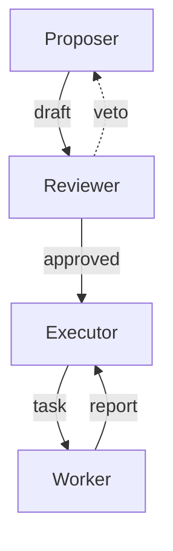

# Example Regime — Organization

> **This is an example, not a historical regime.** It exists so that a reader
> can run the zero-dependency pipeline (topology validate → graph metrics →
> baseline control → validate the control again) without a model backend or an
> API key. The 57 real regimes live under `regimes/`; this one deliberately does
> not.

## Overview

A minimal checks-and-balances shape with four offices:

- **Proposer** drafts a plan.
- **Reviewer** may veto the proposer's draft or forward it.
- **Executor** dispatches approved work to the Worker.
- **Worker** performs the work and reports back.

## Role Mapping Table

The header row of the table below must contain the exact column name that the
engine's markdown parser (`engine/regime-to-cc.mjs::parseIdentityTable`) looks
for. A prose format (`### Agent N:` bullets) parses to **0 agents and silently
passes**, which is exactly the trap this example is here to help you avoid.

| Role | Agent ID | Duty | Model |
|---|---|---|---|
| Proposer | `proposer` | Drafts the initial plan for the task | opus |
| Reviewer | `reviewer` | Audits the draft; may veto and send it back | opus |
| Executor | `executor` | Dispatches approved work and consolidates reports | sonnet |
| Worker | `worker` | Performs the actual engineering work | sonnet |

## Decision Flow

1. **User request** → Proposer.
2. **Proposer** produces a draft.
3. **Reviewer** either vetoes (returns to Proposer) or approves.
4. **Executor** dispatches the approved plan to the Worker.
5. **Worker** performs the work and reports back to Executor.
