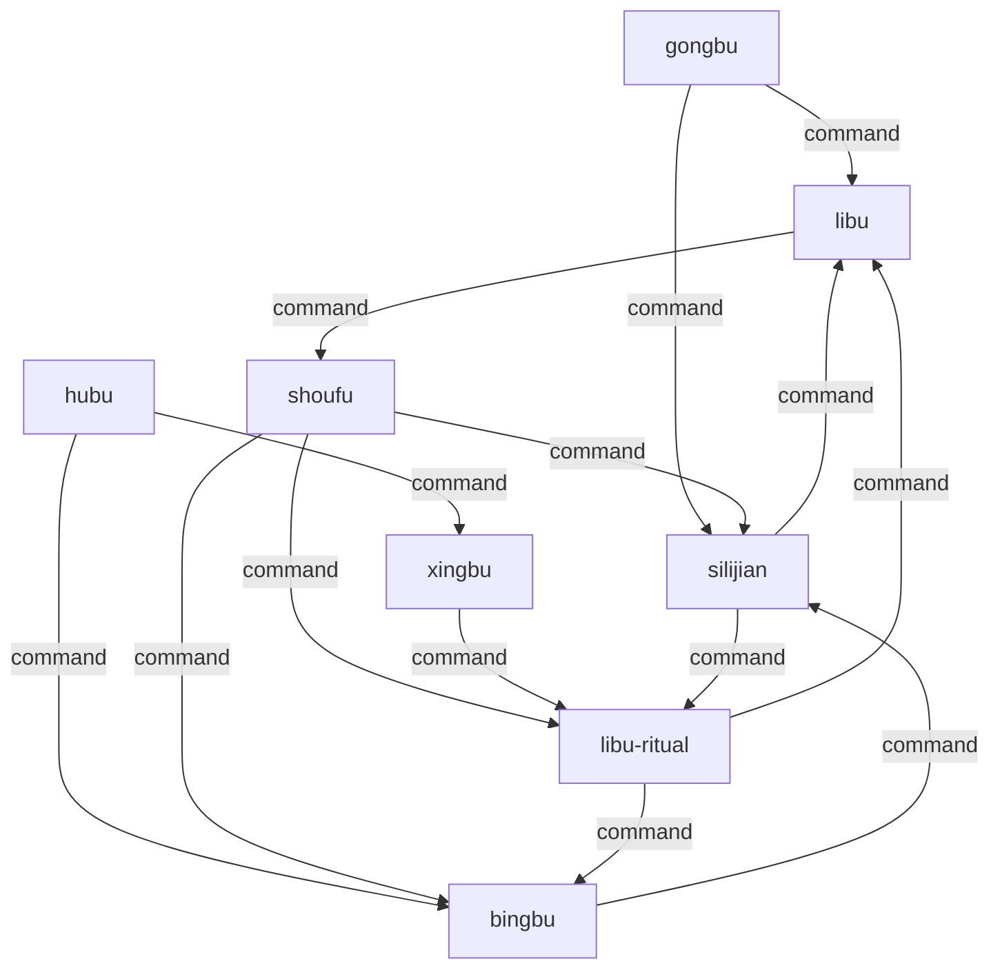

# 明朝 · 内阁制+司礼监 — 组织架构

## 制度简介

明朝（1368-1644）废除丞相制度，皇权空前强化。朱元璋之后，皇帝精力有限，
逐渐形成内阁票拟、司礼监批红的双轨决策体系。内阁首辅起草政策建议（票拟），
司礼监代行批红（秉笔太监代笔批红、掌印太监复核用印），两者相互制约又相互依存，是中国历史上独特的双权力中心制度。

## 组织架构图

## 角色映射表

| 历史角色 | Agent ID | AI 职责 | 推荐模型 |
|---|---|---|---|
| 内阁首辅 | shoufu | coordinator | opus |
| 司礼监（秉笔·掌印太监） | silijian | review | opus |
| 吏部尚书 | libu | management | sonnet |
| 户部尚书 | hubu | data | sonnet |
| 兵部尚书 | bingbu | engineering | sonnet |
| 刑部尚书 | xingbu | legal | sonnet |
| 礼部尚书 | libu-ritual | content | haiku |
| 工部尚书 | gongbu | devops | haiku |

## Decision Flow (experimental control — rewired)

The offices above are unchanged from the source regime. Their coordination
structure is not: this variant follows the flow below and nothing else.

Any description of the historical decision procedure earlier in this file is
background on the offices, not the procedure to follow. Where it conflicts
with the flow below, the flow below governs.

- `gongbu` directs `libu`.
- `gongbu` directs `silijian`.
- `shoufu` directs `silijian`.
- `shoufu` directs `libu-ritual`.
- `xingbu` directs `libu-ritual`.
- `hubu` directs `xingbu`.
- `hubu` directs `bingbu`.
- `shoufu` directs `bingbu`.
- `libu` directs `shoufu`.
- `libu-ritual` directs `bingbu`.
- `silijian` directs `libu-ritual`.
- `libu-ritual` directs `libu`.
- `bingbu` directs `silijian`.
- `silijian` directs `libu`.

Agents: shoufu, silijian, libu, hubu, bingbu, xingbu, libu-ritual, gongbu
