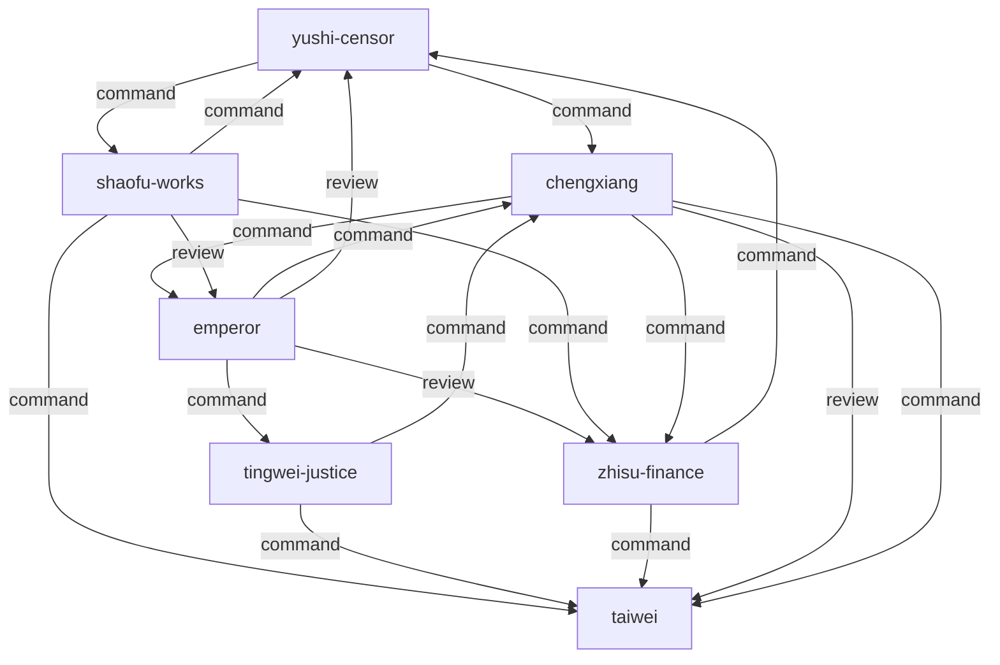

# 秦朝 · 三公九卿制 — 组织架构

## 制度简介
三公九卿制是秦朝统一六国后建立的中央集权行政体系（221-206 BC）。以三公（丞相、太尉、御史大夫）为核心，九卿分管具体事务，形成中国历史上第一个官僚制帝国架构。This system established China's first centralized imperial bureaucracy under Legalist governance.

## 组织架构图

## 角色映射表
| 历史角色 | Agent ID | AI 职责 | 推荐模型 |
|---|---|---|---|
| 皇帝 | emperor | coordinator | opus |
| 丞相 | chengxiang | management | sonnet |
| 太尉 | taiwei | engineering | sonnet |
| 御史大夫 | yushi-censor | review | opus |
| 廷尉 | tingwei-justice | legal | haiku |
| 治粟内史 | zhisu-finance | data | haiku |
| 少府 | shaofu-works | devops | haiku |

## Decision Flow (experimental control — rewired)

The offices above are unchanged from the source regime. Their coordination
structure is not: this variant follows the flow below and nothing else.

Any description of the historical decision procedure earlier in this file is
background on the offices, not the procedure to follow. Where it conflicts
with the flow below, the flow below governs.

- `yushi-censor` directs `chengxiang`.
- `emperor` directs `chengxiang`.
- `emperor` reviews the output of `zhisu-finance`.
- `shaofu-works` directs `zhisu-finance`.
- `shaofu-works` directs `taiwei`.
- `tingwei-justice` directs `taiwei`.
- `emperor` reviews the output of `yushi-censor`.
- `emperor` directs `tingwei-justice`.
- `chengxiang` directs `emperor`.
- `zhisu-finance` directs `yushi-censor`.
- `chengxiang` directs `zhisu-finance`.
- `zhisu-finance` directs `taiwei`.
- `tingwei-justice` directs `chengxiang`.
- `chengxiang` reviews the output of `taiwei`.
- `shaofu-works` directs `yushi-censor`.
- `chengxiang` directs `taiwei`.
- `shaofu-works` reviews the output of `emperor`.
- `yushi-censor` directs `shaofu-works`.

Agents: emperor, chengxiang, taiwei, yushi-censor, tingwei-justice, zhisu-finance, shaofu-works
