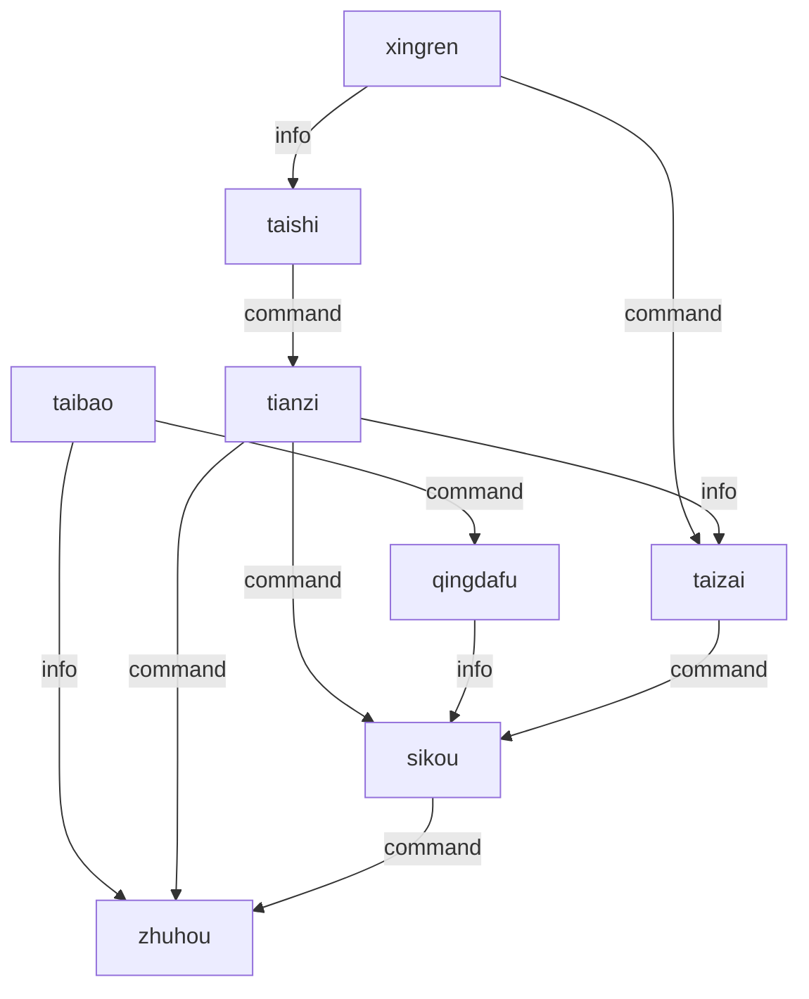

# 周朝宗法分封制 — 组织架构

## 制度简介
周朝（c. 1046-256 BC）是中国历史上存续时间最长的王朝，分为西周与东周两个时期。周人首创宗法分封制——天子封土授民于宗室功臣，诸侯再封卿大夫，层层分封形成「天子—诸侯—卿大夫—士」的等级秩序。以嫡长子继承制为核心的宗法制度与周礼规范共同维系政治合法性，「礼乐征伐自天子出」为理想秩序。

## 组织架构图

## 角色映射表
| 历史角色 | Agent ID | AI 职责 | 推荐模型 |
|---|---|---|---|
| 天子 | tianzi | coordinator：全局统筹、争端仲裁、方向指引 | sonnet |
| 太宰 | taizai | management：政令传达、百官考核、流程管理 | sonnet |
| 太师 | taishi | engineering：代码开发、架构设计、技术攻关 | opus |
| 太保 | taibao | content：文档编撰、知识传承、规范制定 | haiku |
| 诸侯 | zhuhou | management：独立项目全生命周期管理 | sonnet |
| 卿大夫 | qingdafu | engineering：具体任务执行、模块开发 | haiku |
| 司寇 | sikou | legal：合规检查、代码审查、安全审计 | opus |
| 行人 | xingren | research：外交联络、信息收集、会盟协调 | haiku |

## Decision Flow (experimental control — rewired)

The offices above are unchanged from the source regime. Their coordination
structure is not: this variant follows the flow below and nothing else.

Any description of the historical decision procedure earlier in this file is
background on the offices, not the procedure to follow. Where it conflicts
with the flow below, the flow below governs.

- `xingren` is kept informed by `taishi`.
- `xingren` directs `taizai`.
- `tianzi` is kept informed by `taizai`.
- `tianzi` directs `sikou`.
- `qingdafu` is kept informed by `sikou`.
- `taibao` directs `qingdafu`.
- `taibao` is kept informed by `zhuhou`.
- `tianzi` directs `zhuhou`.
- `taishi` directs `tianzi`.
- `sikou` directs `zhuhou`.
- `taizai` directs `sikou`.

Agents: tianzi, taizai, taishi, taibao, zhuhou, qingdafu, sikou, xingren
