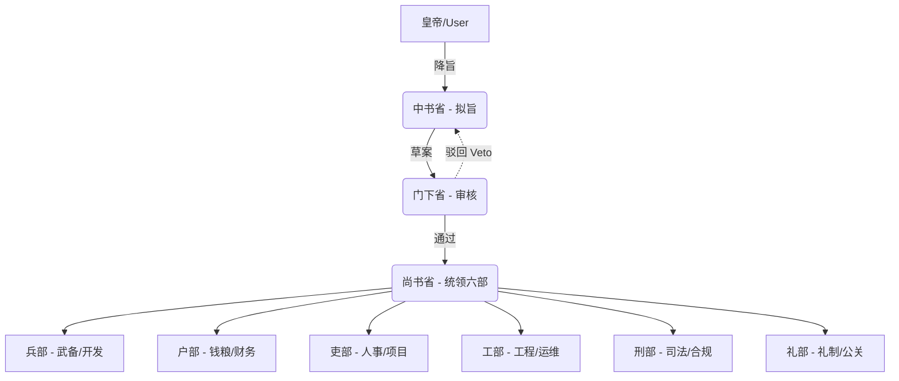

# 唐朝三省六部制 — 组织架构

## 制度简介

三省六部制是中国古代最成熟的中央官制体系之一，始创于隋朝，在唐朝（618-907）发展至巅峰。其核心框架（三省分权 + 六部分工）不仅极大地提高了行政效率，更重要的是形成了一种互相制衡（Checks and Balances）的权力拓扑网络。

三省分别是：
- **中书省 (Zhongshu)**：负责起草诏令。
- **门下省 (Menxia)**：负责审核诏令，拥有“封驳权”（Veto），如果认为不妥可以拒绝签署并退回中书省。
- **尚书省 (Shangshu)**：最高行政机构，负责接收已通过的诏令，并下发至其管辖的六部执行。

## 组织架构图

## 角色映射表

| 古代角色 | Agent ID | AI 职责 | 推荐模型 |
|---|---|---|---|
| 中书省 (Drafting) | `zhongshu` | **发起者**：解析用户需求，拆解并起草执行方略 | 强力模型 |
| 门下省 (Veto & Audit) | `menxia` | **审核者**：审查中书省方略，若违背历史规则或逻辑不通则行使否决权驳回 | 强力模型 |
| 尚书省 (Execution) | `shangshu` | **调度者**：接收通过的方略，向六部分派具体执行任务 | 快速模型 |
| 兵部尚书 | `bingbu` | 软件工程/武备：代码架构、防御工事建立 | 强力模型 |
| 户部尚书 | `hubu` | 财务运营：成本分析、预算管控、数据分析 | 强力模型 |
| 礼部尚书 | `libu_ritual` | 品牌营销：文案创作、对外公关 | 快速模型 |
| 工部尚书 | `gongbu` | 运维部署：基础建设、防御工事加固 | 快速模型 |
| 刑部尚书 | `xingbu` | 法务合规：安全审计、规则审查 | 快速模型 |
| 吏部尚书 | `libu_personnel` | 项目管理：任务跟踪、统筹协调 | 快速模型 |

## 协作流程

1. **陛下下旨** → 向中书省提出战略目标。
2. **中书拟定** → `zhongshu` 提出完整的系统实施草案。
3. **门下封驳** → `menxia` 审核，如果不通过则直接驳回让 `zhongshu` 重写。
4. **尚书分发** → `shangshu` 接到无误草案，分派给六部。
5. **六部执行** → 各部落地实施。
